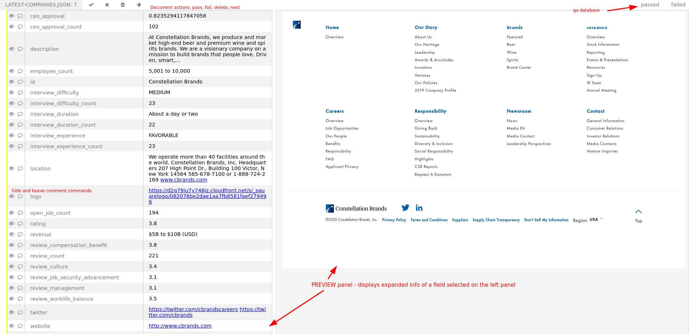

# docqa

WORK IN PROGRESS

Webapp for quality assurance of json documents.



## Usage 

`docqa` is a [flask] application. For more detailed instructions see [official flask running instructions][flask-run]

```shell script
$ git clone https://github.com/Granitosaurus/docqa
$ cd docqa
$ export FLASK_APP='docqa/app.py'
$ poetry install
$ poetry run flask run
```

[flask]: https://palletsprojects.com/p/flask/
[flask-run]: https://flask.palletsprojects.com/en/1.1.x/